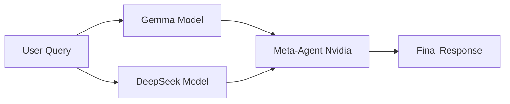

# 🧠 LLM Meta-Agent

An advanced AI system that combines the power of multiple language models to deliver superior, well-rounded responses. It uses a large language model (LLM) as its central brain to autonomously design, optimize, and manage a system of other specialized AI agents.


## ✨ Features

- **🔄 Multi-Model Intelligence**: Leverages insights from multiple AI models (Gemma, DeepSeek, Nvidia)
- **🎯 Enhanced Accuracy**: Cross-validates responses for better reliability
- **📊 Comprehensive Answers**: Combines perspectives for richer content
- **👁️ Transparent Process**: View individual model inputs in real-time
- **🎨 Beautiful UI**: Modern, responsive interface with dark/light themes
- **💬 Multi-line Input**: Support for complex queries with Shift+Enter
- **🎭 Animated Doodles**: Decorative background elements for enhanced visual appeal


## 🏗️ Architecture

### How It Works

1. **User Input**: User submits a query through the web interface
2. **Parallel Processing**: Query is sent to both Gemma (Google) and DeepSeek models
3. **Meta-Synthesis**: Nvidia Meta-Agent analyzes both responses
4. **Final Answer**: Delivers a comprehensive, accurate response combining all insights



> **🏆 Unique Architecture**: This project utilizes a groundbreaking multi-model consensus approach. To date, the **OpenAI Council** is the only other system known to employ a comparable architecture for autonomous multi-agent synthesis.

## 🚀 Getting Started

### Prerequisites

- **Java 23.0.2** or higher
- **Maven** (or use included Maven Wrapper)
- **API Keys**:
  - OpenRouter API Key (provides access to all required models)

### Installation

1. **Clone the repository**
   ```bash
   git clone https://github.com/gaurabhkr/LLM-Meta-Agent.git
   cd LLM-Meta-Agent
   ```

2. **Configure API Keys**
   
   Set environment variable with your OpenRouter API key:
   ```bash
   export OPENROUTER_API_KEY=your_openrouter_api_key_here
   ```

3. **Run the application**
   ```bash
   ./mvnw spring-boot:run
   ```
   
   Or on Windows:
   ```bash
   mvnw.cmd spring-boot:run
   ```

4. **Access the application**
   
   Open your browser and navigate to:
   ```
   http://localhost:8080
   ```

## 🚀 Deployment

Want to put this online? Check out our detailed **[Deployment Guide](DEPLOY.md)** for instructions on how to deploy to Render via GitHub.

## 🎨 UI Features

### Theme Switching
- **Dark Mode** (default): Deep navy background with vibrant purple accents
- **Light Mode**: Clean white background with subtle purple tones
- **Persistence**: Your theme preference is saved in localStorage

### Multi-line Messages
- Press **Enter** to send your message
- Press **Shift+Enter** to create a new line
- Textarea auto-resizes based on content

### About Section
Click the **ℹ️ Info** button in the header to learn more about:
- How the Meta-Agent system works
- Key features and benefits
- Available AI models
- Technology stack

## 🛠️ Technology Stack

### Backend
- **Spring Boot 3.5.9** - Application framework
- **Spring AI** - AI model integration
- **Maven** - Dependency management
- **Tomcat** - Embedded web server

### Frontend
- **HTML5** - Structure
- **CSS3** - Styling with CSS Variables
- **Vanilla JavaScript** - Interactivity
- **Font Awesome 6.5.1** - Icons

### AI Models
- **Gemma (Google)** - Precise and contextual understanding
- **DeepSeek** - Deep reasoning and analytical responses
- **Nvidia Meta-Agent** - Response synthesis and optimization

## 📁 Project Structure

```
LLM-Meta-Agent/
├── src/
│   └── main/
│       ├── java/
│       │   └── com/llm/LLM/Meta_Agent/
│       │       └── Controller/
│       │           └── LLMMetaAgentController.java
│       └── resources/
│           └── static/
│               ├── index.html
│               ├── style.css
│               └── script.js
├── pom.xml
└── README.md
```

## 🔌 API Endpoints

### Main Endpoints

- `GET /api/gemma/{message}` - Query Gemma model directly
- `GET /api/deepseek/{message}` - Query DeepSeek model directly
- `GET /api/nvidia/{message}` - Query Meta-Agent (synthesized response)

### Meta-Agent Insights

- `GET /api/nvidia/firstmodelresponse` - Get Gemma's response from last query
- `GET /api/nvidia/secondmodelresponse` - Get DeepSeek's response from last query

## 🎯 Usage Examples

### Direct Model Query
```javascript
fetch('/api/gemma/What is artificial intelligence?')
  .then(response => response.text())
  .then(data => console.log(data));
```

### Meta-Agent Query (Recommended)
```javascript
fetch('/api/nvidia/Explain quantum computing')
  .then(response => response.text())
  .then(data => console.log(data));
```

## 🌟 Key Highlights

### Multi-Model Synthesis
Instead of relying on a single AI model, the Meta-Agent:
1. Consults multiple specialized models
2. Analyzes their different perspectives
3. Synthesizes a comprehensive final answer
4. Provides transparent access to sub-model responses


### Modern UI/UX
- **Glassmorphism effects** for depth
- **Smooth animations** on all interactions
- **Auto-resizing textarea** for input
- **Floating background doodles** for visual interest
- **Responsive design** for all screen sizes


## 🤝 Contributing

Contributions are welcome! Please feel free to submit a Pull Request.

1. Fork the repository
2. Create your feature branch (`git checkout -b feature/AmazingFeature`)
3. Commit your changes (`git commit -m 'Add some AmazingFeature'`)
4. Push to the branch (`git push origin feature/AmazingFeature`)
5. Open a Pull Request

## 📝 License

This project is licensed under the MIT License - see the LICENSE file for details.

## 👤 Author

**Gaurabh Kumar**
- GitHub: [@gaurabhkr](https://github.com/gaurabhkr)

## 🙏 Acknowledgments

- Spring Boot team for the excellent framework
- Spring AI for seamless AI integration
- OpenRouter for providing access to top-tier AI models
- Google, DeepSeek, and Nvidia for their powerful AI models
- Font Awesome for beautiful icons

## 📧 Contact

For questions or feedback, please open an issue on GitHub.

---

⭐ If you find this project useful, please consider giving it a star!
